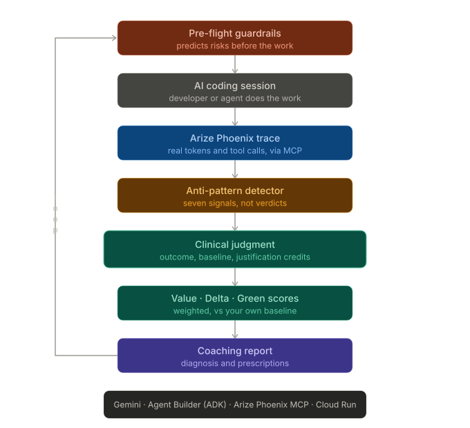

# 🐱 AI RaidMeter
### Personal Green Coding Coach for AI Workflows

**Google Cloud Rapid Agent Hackathon 2026 — Arize Track** | Built by Chloe Kao × Claude (Anthropic) × Gemini (Google)

> **From tokenmaxxing to value-aware AI governance.**
> *Catch AI token waste before it happens — judged live by a Gemini agent reading your real Arize Phoenix traces.*

---

[](https://phoenix.arize.com)
[](https://cloud.google.com)

[](https://cloud.google.com/run)
[](LICENSE)

---

🎬 **Demo Video:** https://youtu.be/i31tddmGfqg

🔗 **Live Dashboard:** https://ai-raidmeter-733974887555.us-central1.run.app

🤖 **Interactive Agent:** https://ai-raidmeter-agent-733974887555.us-central1.run.app/dev-ui/

---

## The Problem

Most teams measure AI adoption with one number: **how many tokens did you burn?** It's the easiest metric to collect — and the most misleading one. It rewards looking busy.

- 🔥 **Wrong incentive** — A developer who burns 1M tokens thrashing outranks one who solves the same task in a fifth of the cost.
- 👻 **Invisible waste** — Reading whole files before locating the bug, looping on local tests, retrying without reading the error. A token leaderboard can't see any of it.
- 📉 **Wrong question** — "Who used the most AI?" instead of "Which AI workflows actually created value?"

These aren't coding mistakes. They're **workflow anti-patterns** — and they live in the *shape* of a session, not its token count.

---

## The Solution

AI RaidMeter is a **Gemini-powered Green Coding Coach** that reads real Arize Phoenix traces, judges efficiency with a multi-criteria method instead of a single number, and helps developers improve against **their own past baseline** — not a public ranking of people.

```
🛫 Pre-flight Guardrails  → predicts the next task's risks, issues guardrails up front
        ↓
🖥️  AI Coding Session      → the developer / agent does the work
        ↓
🔭 Arize Phoenix Trace    → real tokens, tool calls, latency, retries (via MCP)
        ↓
🔍 Anti-pattern Detector  → seven token-waste signals (symptoms, not verdicts)
        ↓
🩺 Clinical Judgment      → multi-criteria: outcome + baseline + time-box + justification
        ↓
📊 Value / Delta / Green  → three scores, weighted
        ↓
💬 Coaching Report        → diagnosis + specific prescriptions
        ↓
        └──────── loops back to the next Pre-flight ────────┘
```


---

## The Headline Result

Same developer, before & after coaching, on the **same class** of cloud-deployment bugfix. The judgment is produced **live** by a Gemini agent reading a **real** Arize trace via Phoenix MCP.

| Metric | 🔴 Before | 🟢 After |
|--------|-----------|----------|
| **Tokens** | 1,000K | **420K** ⬇️ −58% |
| **Time** | 95 min | **38 min** ⬇️ −60% |
| **Anti-patterns** | 5 *(Level 3)* | **0** *(Level 0)* ✅ |
| **Outcome** | PR rejected ❌ | **PR merged** ✅ |
| **RaidMeter Score** | 0.0 | **56.1** 🚀 |

> Delta Score **75.4** — measured only against the developer's own history.

---

## The Three Pillars

| Pillar | Role | Powered by |
|--------|------|-----------|
| 🧠 Reasoning | Detection narrative · coaching · pre-flight prediction | Gemini (3.5 Flash / 3.1 Pro) |
| 🏗️ Orchestration | LlmAgent with live dev-ui, real tools, plans & reports | Google Cloud Agent Builder (ADK) |
| 🔭 Observability | Queries genuine traces; OpenInference auto-captures spans | Arize Phoenix MCP |

> The agent runs **live and interactive** for judges, querying real traces via Phoenix MCP — the partner integration is **core, not decoration. The loop is closed, not mocked.**

---

## Key Design Decisions

**🩺 Clinical, multi-criteria judgment**
A detected signal is never a verdict. The scorer combines anti-pattern signals with task type, outcome, time-box, and the developer's historical baseline — and applies **justification credits**, so a legitimately hard production incident isn't punished like idle thrashing. *One symptom is never a diagnosis.*

**🛫 Pre-flight, not post-mortem**
The agent predicts a task's likely risks *before* the work starts and issues concrete guardrails (cap failed deploys at 2, never paste 30+ lines of raw logs, validate templates before remote deploy). This turns the product from a dashboard into a proactive agent.

**🤝 A coach, not a surveillance tool**
Scoring measures developers against their own past, never against each other. No public leaderboard of people — only workflow-level coaching.

**🌱 Green efficiency as a proxy**
Token / time / compute savings are reported as *estimated proxies*, never as precise carbon accounting. ESG is an amplifier, not the headline.

---

## Tech Stack

| Layer | Technology |
|-------|-----------|
| Reasoning | Gemini 3.5 Flash / 3.1 Pro (Vertex AI) |
| Agent Platform | Google Cloud Agent Builder — Agent Development Kit (ADK) |
| Observability | Arize Phoenix (traces, evals) + Phoenix MCP server |
| Instrumentation | OpenInference (auto-capture of Gemini calls) |
| Backend | Python / Flask |
| Deployment | Google Cloud Run |

---

## Repository Structure

```
ai-raidmeter/
├── dashboard/                  # Main web app (Flask on Cloud Run)
│   ├── main.py                 # Routes + live APIs (/api/coach, /api/live, /api/preflight)
│   ├── detectors/
│   │   ├── rules.json          # 7 anti-patterns, machine-readable
│   │   └── detector.py         # Rule engine over trace fields
│   ├── scoring/
│   │   ├── criteria.json       # Clinical multi-criteria thresholds
│   │   ├── clinical.py         # Waste-tendency classifier (L0–L3)
│   │   ├── weights.json        # Three-score weights
│   │   └── score.py            # Value / Delta / Green scorer
│   ├── agent/
│   │   ├── coach.py            # Gemini coaching report
│   │   └── preflight.py        # Gemini pre-flight risk prediction
│   ├── data/
│   │   ├── arize_adapter.py    # Reads real Phoenix spans → normalized session
│   │   └── sessions.json       # Before/After demo sessions
│   └── static/index.html       # Dashboard + embedded live chat
└── agent-service/              # Standalone ADK agent (own Cloud Run service)
    ├── main.py                 # ADK FastAPI app with dev-ui
    ├── Dockerfile              # Pre-installs Phoenix MCP at build time
    └── raidmeter_agent/        # LlmAgent + Phoenix MCP toolset
```

---

## Setup

### Prerequisites
- Google Cloud project with Vertex AI enabled
- Arize Phoenix workspace ([app.phoenix.arize.com](https://app.phoenix.arize.com))
- Cloud Run access

### Environment Variables
```bash
GOOGLE_CLOUD_PROJECT=your_gcp_project_id
GOOGLE_CLOUD_LOCATION=global
RAIDMETER_MODEL=gemini-3.5-flash
PHOENIX_COLLECTOR_ENDPOINT=https://app.phoenix.arize.com/s/your-space
PHOENIX_API_KEY=your_phoenix_key
GOOGLE_GENAI_USE_VERTEXAI=TRUE
```

> 🔒 Secrets are read from environment variables only (`os.environ.get`) — nothing is hard-coded. Keep keys in a file outside git and inject with `--env-vars-file`.

### Deploy the Dashboard
```bash
cd dashboard
gcloud run deploy ai-raidmeter \
  --source . \
  --region us-central1 \
  --allow-unauthenticated \
  --memory 2Gi \
  --env-vars-file=path/to/env-vars.yaml
```

### Run the Agent (ADK)
```bash
cd agent-service
pip install --user google-adk mcp
export PATH="$HOME/.local/bin:$PATH"
adk run raidmeter_agent
# Then ask: "What anti-patterns show up in the ai-raidmeter traces?"
```

---

## Try the Live Agent

Open the **Interactive Agent** link and ask:

- *"What anti-patterns show up in the ai-raidmeter traces?"*
- *"Diagnose the latest trace in the ai-raidmeter project."*
- *"Give me a green-coding scorecard for ai-raidmeter."*

The agent connects to Phoenix MCP, pulls **real** traces, and returns a multi-criteria clinical diagnosis.

---

## Built With ❤️ By

**Chloe Kao** (AI Orchestrator & Product Lead)
× **Claude 阿寶** (Architecture & Core Brain / Anthropic)
× **Gemini** (Reasoning Engine / Google)

> *"Token count is an incentive, not a measurement.*
> *The real signal lives in the shape of a session — and that's exactly what trace observability exposes."*

---

## License

MIT License — see [LICENSE](LICENSE).
